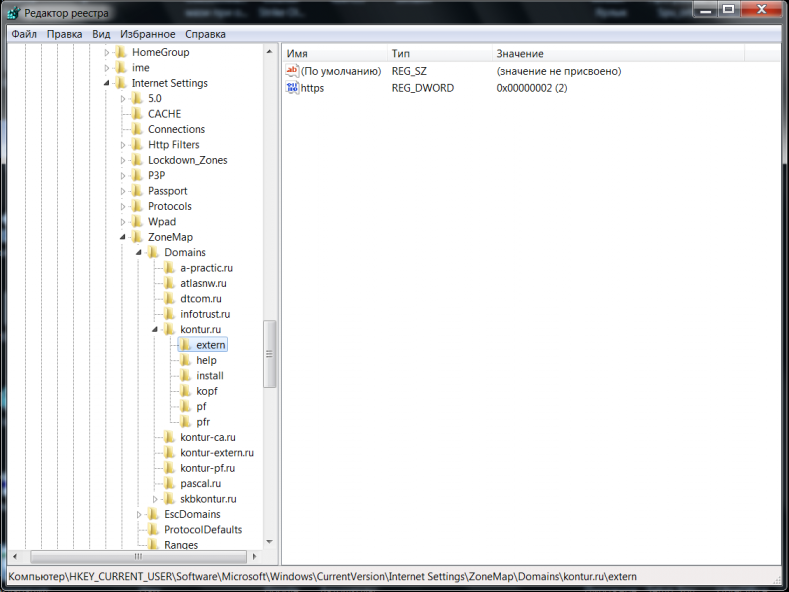

.. _experience:

Практические приёмы работы с Реестром
==================================================

В данном разделе рассматриваются практические примеры работы с реестром:

* :ref:`csp-license`
* :ref:`kep-registry`
* :ref:`kep-recovery`
* :ref:`RegBack`
* :ref:`label-calais`
* :ref:`AddToTrusted`

.. _csp-license:

Лицензия КриптоПро в реестре [1017]
--------------------------------------------------

Лицензия КриптоПро хранится в реестре, её можно оттуда скопировать, либо ввести.

1) Перейти в ветку:

 **КриптоПро 3.6**:

 ::

    HKEY_LOCAL_MACHINE\SOFTWARE\Microsoft\Windows\CurrentVersion\Installer
    \UserData\S-1-5-18\Products\05480A45343B0B0429E4860F13549069\InstallProperties

 **КриптоПро 3.9**:

 ::

    HKEY_LOCAL_MACHINE\SOFTWARE\Microsoft\Windows\CurrentVersion\Installer  
    \UserData\S-1-5-18\Products\68A52D936E5ACF24C9F8FE4A1C830BC8\InstallProperties

 **КриптоПро 4.0**:

 ::

    HKEY_LOCAL_MACHINE\SOFTWARE\Microsoft\Windows\CurrentVersion\Installer
    \UserData\S-1-5-18\Products\7AB5E7046046FB044ACD63458B5F481C\InstallProperties

 **КриптоПро 3.0**:

 ::

    HKLM\SOFTWARE\Microsoft\Windows\CurrentVersion\Installer\UserData\S-1-5-18
    \Products\0CC4F742C3275A04A9832E2E2CD4BE64\InstallProperties\ProductID

2) Открыть двойным нажатием левой кнопки мыши параметр ``ProductID`` и прописать в поле ``Значение`` серийный номер лицензии (можно с дефисами, можно без). Либо скопировать номер лицензии оттуда.

----------------

.. _kep-registry:

Где хранятся ключи(закрытый ключ сертификата) в реестре? [1739]
----------------------------------------------------------------

Реестр может использоваться в качестве ключевого носителя, другими словами, в него можно скопировать Квалифицированную электронную подпись (КЭП). После копирования закрытые ключи будут находиться:

* для 32-битной ОС:

::

    HKEY_LOCAL_MACHINE\SOFTWARE\CryptoPro\Settings\
    Users\(идентификатор пользователя)\Keys\(Название контейнера)

* для 64-битной ОС:

:: 

    HKEY_LOCAL_MACHINE\SOFTWARE\Wow6432Node\Crypto Pro\Settings
    \USERS\(идентификатор пользователя)\Keys\(Названиеконтейнера)

* В некоторых случаях сертификат попадает сюда:

::

    HKEY_USERS\S-1-5-21-{SID}_Classes\VirtualStore\MACHINE\SOFTWARE
    \[Wow6432Node]\Crypto Pro\Settings\USERS\S-1-5-21-{SID}\Keys\

.. _user-sid:

Где SID (идентификатор пользователя) (англ. *Security Identifier (SID)*)  —  структура данных переменной длины, которая идентифицирует учетную запись пользователя, группы, домена или компьютера.

.. index:: Security Identifier (SID)

Узнать SID пользователя можно через командную строку (*«Пуск → Выполнить → cmd»*), введя команду ``WHOAMI /USER``.

.. _registry-023:

.. figure:: img/registry-023.jpg
       :width: 400 px
       :align: center
       :alt: Рис. 23 – Узнать SID пользователя через командную строку
       
       Рис. 23 – Узнать SID пользователя через командную строку

.. tip:: Чтобы скопировать текст из командной строки Windows, необходимо нажать правой кнопкой мыши на заголовок окна консоли и в меню *«Свойства»* на вкладке *«Общие»* включить опцию *«Выделение мышью»*.

-----------

.. _kep-recovery:

Восстановление закрытых ключей с неисправного компьютера
-----------------------------------------------------------

.. tip:: Обязательно ознакомьтесь с главой :ref:`work-whith-regedit` и разделами:

    * :ref:`open-regedit`
    * :ref:`hive-load`;
    * :ref:`regedit-rules`;
    * :ref:`all-rules`;
    * :ref:`psexec`.

Есть возможность восстановить закрытые ключи сертификата, если они были записаны в реестре компьютера и этот компьютер сломался.

Это можно сделать только в том случае, если жесткий диск в рабочем состоянии и есть возможность его подключить к рабочему системному блоку. Или есть копия папки ``C:\Windows\System32\config\``.

Если условия выполняются, необходимо проделать следующее:

1. Подключить жесткий диск от неработающего компьютера к рабочему системному блоку;

.. index:: PsExec.exe

2. `Скачать <https://technet.microsoft.com/ru-ru/sysinternals/bb897553.aspx>`_ утилиту ``PsExec.exe`` и скопировать ее в корень диска ``C``.

 Открыть редактор реестра с помощью утилиты ``PsExec.exe`` (см. раздел :ref:`psexec`). В командной строке (*«Пуск → Выполнить → cmd»*) ввести команду;

 ::

    C:\PsExec.exe -i -s regedit.exe

3. Загрузить куст ``HKEY_LOCAL_MACHINE\Software`` (см. раздел :ref:`hive-load`):

    * Перейти в раздел ``HKEY_LOCAL_MACHINE``;
    * Выбрать *«Файл → Загрузить куст»*;
    * В файловом менеджере выбрать соответствующий файл куста с нерабочего компьютера  ``C:\Windows\System32\config\SOFTWARE``;
    * Задать произвольное имя загруженному кусту, например, ``AZAZAZ``.

 Загрузка куста может занять некоторое время.

4. Перейти в раздел, в котором хранятся :abbr:`КЭП (Квалифицированная электронная подпись)`;

 * для 32-битной ОС:

 ::

    HKEY_LOCAL_MACHINE\ASASAS\CryptoPro\Settings\
    Users\(идентификатор пользователя)\Keys\(Название контейнера)

 * для 64-битной ОС:

 :: 

    HKEY_LOCAL_MACHINE\ASASAS\Wow6432Node\Crypto Pro\Settings
    \USERS\(идентификатор пользователя)\Keys\(Названиеконтейнера)

 В некоторых случаях сертификат попадает сюда:

 ::

    HKEY_USERS\S-1-5-21-{SID}_Classes\VirtualStore\MACHINE\SOFTWARE
    \[Wow6432Node]\Crypto Pro\Settings\USERS\S-1-5-21-{SID}\Keys\

5. После того, как найден нужный раздел с ключами:

 * Нажать на подраздел ``keys`` правой кнопкой мыши и выбрать пункт *«Экспортировать»* (см. раздел :ref:`export`).
 * Выбрать место для сохранения и задать имя файла. Экспортированный файл будет иметь расширение ``.reg``.
 * Если требуется, перенести экспортированный файл с расширением ``.reg`` на другой компьютер.

.. index:: Security Identifier (SID)

6. Открыть экспортированный файл с расширением ``.reg`` в текстовом редакторе (Notepad++, Блокнот) и изменить в файле идентификатор пользователя (SID) на идентификатор текущего пользователя, для этого:

 .. figure:: img/registry-024.png
       :width: 400 px
       :align: center
       :alt: Рис. 24 – Изменение пути к веткам реестра
       
       Рис. 24 – Изменение пути к веткам реестра

 * В командной строке (*«Пуск → Выполнить → cmd»*) ввести команду ``WHOAMI /USER`` (см. рисунок :ref:`registry-023`).

.. tip:: Чтобы скопировать текст из командной строки Windows, необходимо нажать правой кнопкой мыши на заголовок окна консоли и в меню *«Свойства»* на вкладке *«Общие»* включить опцию *«Выделение мышью»*.

.. important:: Если разрядность(битность) текущей системы отличается от той, на которой находился контейнер закрытого ключа, то необходимо проверить и при необходимости исправить путь в текстовом редакторе.

7. Сохранить изменения в файле и открыть его двойным щелчком мыши (см. раздел :ref:`import`). Разрешить внести изменения в реестр.

 После этого выполнить установку открытого ключа через Крпто Про CSP (`Инструкция по установке личного сертификата <http://www.kontur-extern.ru/support/faq/34/62>`_).

.. warning:: Перед тем, как вносить изменения в реестр, обязательно создавайте его резервную копию. Подробнее в разделе :ref:`export`.

8. В конце рекомендуется выгрузить ранее загруженный куст *«Файл → Выгрузить куст»*.

.. tip:: Можно запускать реестр и не используя утилиту ``PsExec.exe``, но тогда придется добавлять загруженным веткам права и разрешения вручную так, как описано в разделе :ref:`regedit-rules`. Это не критично, если  речь идет, например, о копировании всего одного контейнера закрытого ключа. Если файлов много, то гораздо быстрее и удобнее использовать ``PsExec.exe``.

 Рекомендую всегда держать на готове утилиту ``PsExec.exe``, ее скачивание и копирование занимает не так много времени. 

----------

.. _RegBack:

Извлечение информации из резервной копии реестра
-----------------------------------------------------------------

Резервные копии реестра обычно создаются автоматически каждые десять дней. Сохраняются они в папке:

* ``C:\Windows\System32\config\RegBack`` – для  Windows 7 и Server 2008;
* ``C:\Windows\repair`` – для XP и Server 2003.

Данные папки содержит те же файлы, что и ``C:\Windows\System32\config\``.

Если, например, из реестра случайно был удален контейнер закрытого ключа, теоретически, есть возможность импортировать куст из резервной копии.

Порядок действия аналогичен, описанному порядку в инструкции :ref:`kep-recovery`. Отличается только файл загружаемого куста ``C:\Windows\System32\config\RegBack\Software``.

-------------

.. _label-calais:

Доступ к считываетлям (Calais)
----------------------------------------

.. index:: Calais

Иногда возникает проблема с доступом к считывателям смарт-карт. Она может быть связана с тем, что у текущего пользователя недостаточно прав на следующие ветки:

::

    HKEY_LOCAL_MACHINE\SOFTWARE\Microsoft\Cryptography\Calais

    HKEY_LOCAL_MACHINE\SOFTWARE\Microsoft\Cryptography\Calais\Readers

Подробнее о настройке прав доступа читайте в разделе :ref:`regedit-rules`.

.. note:: Может возникнуть ситуация, когда текущий пользователь системы даже не будет являться владельцем данных веток реестра, следовательно, у него не будет прав на них. В таком случае, необходимо сначала добавить текущего пользователя во владельцы этих веток, а затем проставить ему соответствующие права, как описано в разделе :ref:`regedit-rules` данного руководства.

-------------

.. _AddToTrusted:

Доверенные узлы
--------------------------------------------------

Если узел не добавляется в надежные узлы, можно добавить его вручную через реестр, для этого необходимо:

1. Перейти в ветку ``HKEY_CURRENT_USER\Software\Microsoft\Windows\CurrentVersion\Internet Settings\ZoneMap\Domains``;
2. Добавить подраздел с названием домена, например, ``kontur.ru``;
3. В добавленном подразделе создать еще один подраздел с названием субдомена: ``extern``;
4. Добавить параметр DWORD ``https`` со значением ``2``

       Рис. 25 – Добавление зон надежных узлов вручную
