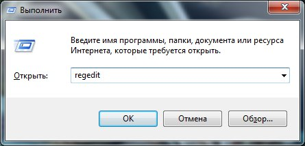
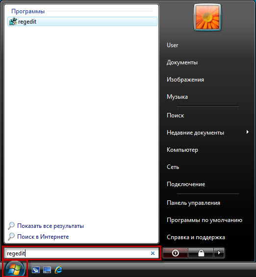
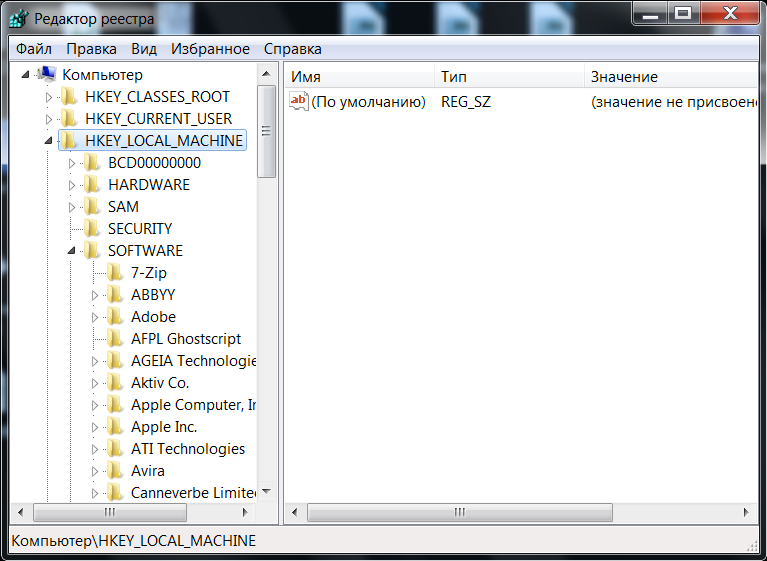
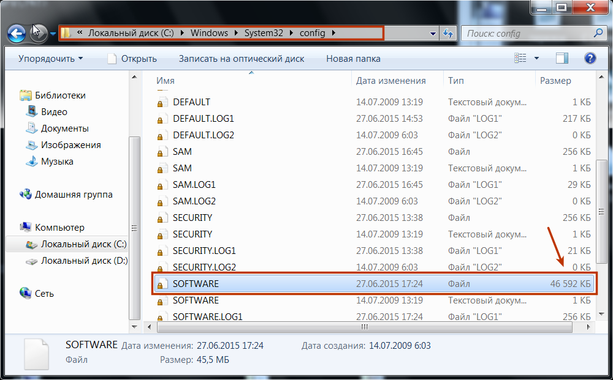

.. _introduce:

Реестр Windows
--------------------------------

**Реестр Windows** (англ. *Windows Registry*), или системный реестр — иерархически построенная база данных параметров и настроек в большинстве операционных систем семейства Microsoft Windows [2].

В реестре хранятся данные, которые необходимы для правильного функционирования Windows. К ним относятся профили всех пользователей, сведения об установленном программном обеспечении и типах документов, которые могут быть созданы каждой программой, информация о свойствах папок и значках приложений, а также установленном оборудовании и используемых портах [1].

.. _open-regedit:

Открытие реестра
~~~~~~~~~~~~~~~~~~~~~~~

Поскольку файлов в реестре несколько, его нельзя открыть, например, в текстовом редакторе и внести какие-либо коррективы. Для работы с ним требуется специальная программа – **редактор реестра**, который является встроенным компонентом операционной системы Windows и вызывается путем ввода  команды ``Regedit`` [4].

Существует несколько способов открыть редактор реестра.

**Способ №1** – Открытие через утилиту *«Выполнить»*:

1) Выбрать *Пуск → Выполнить*, либо нажать сочетание клавиш ``Win+R`` (``Win`` — клавиша, между ``Ctrl`` и ``Alt`` в нижнем ряду клавиатуры, обычно на ней изображен значок Microsoft Windows |win-key|;
2) В открывшимся окне ввести команду ``regedit``;
3) Нажать клавишу ``ОК``.

       Рис. 1 – Открытие через утилиту *«Выполнить»*

.. |win-key| image:: img/icon-win-key.jpg 
                :width: 20 px

**Способ №2** – Открытие через поиск по меню *«Пуск»*:

1) Открыть меню *Пуск*;
2) Ввести в строке поиска ``regedit`` и запустить найденный файл, который отобразится в верхней части *Пуска*.

       Рис. 2 – Открытие через поиск по меню «Пуск»

С другими способами можно ознакомиться в статье `Три способа открыть редактор реестра Windows <http://skesov.ru/tri-sposoba-otkryit-redaktor-reestra-windows/>`_.

Структура реестра
~~~~~~~~~~~~~~~~~~

Реестр имеет иерархическую структуру, которая напоминает файловую систему жесткого диска – с его каталогами, подкаталогами и файлами. Но называются элементы реестра по-другому: верхний уровень иерархии составляют разделы, каждый из которых может содержать вложенные подразделы, а также параметры. Именно в параметрах хранится основное содержимое реестра, разделы служат лишь для группировки схожих по назначению параметров [4].

       Рис. 3 – Редактор реестра

Далее приведен краткий перечень и краткое описание стандартных разделов реестра. Максимальная длина имени раздела составляет 255 символов. 

**HKEY_CURRENT_USER**

Данный раздел является корневым для данных конфигурации пользователя, вошедшего в систему в настоящий момент. Здесь хранятся папки пользователя, цвета экрана и параметры панели управления. Эти сведения сопоставлены с профилем пользователя. Вместо полного имени раздела иногда используется аббревиатура ``HKCU``.

**HKEY_USERS**

Данный раздел содержит все активные загруженные профили пользователей компьютера. Раздел ``HKEY_CURRENT_USER`` является подразделом раздела ``HKEY_USERS``. Вместо полного имени раздела иногда используется аббревиатура ``HKU``.

**HKEY_LOCAL_MACHINE**

Раздел содержит параметры конфигурации, относящиеся к данному компьютеру (для всех пользователей). Наиболее интересным является подраздел ``Software``, который включает в себя настройки всех установленных в системе приложений. Вместо полного имени раздела иногда используется аббревиатура ``HKLM``.

**HKEY_CLASSES_ROOT**

Является подразделом ``HKEY_LOCAL_MACHINE\Software``. Хранящиеся здесь сведения обеспечивают выполнение необходимой программы при открытии файла с использованием проводника. Вместо полного имени раздела иногда используется аббревиатура ``HKCR``. Начиная с Windows 2000, эти сведения хранятся как в ``HKEY_LOCAL_MACHINE``, так и в ``HKEY_CURRENT_USER``. 

Раздел ``HKEY_LOCAL_MACHINE\Software\Classes`` содержит параметры по умолчанию, которые относятся ко всем пользователям локального компьютера. Параметры, содержащиеся в разделе ``HKEY_CURRENT_USER\Software\Classes``, переопределяют принятые по умолчанию и относятся только к текущему пользователю. 

Раздел ``HKEY_CLASSES_ROOT`` включает в себя данные из обоих источников. Кроме того, раздел ``HKEY_CLASSES_ROOT`` предоставляет эти объединенные данные программам, разработанным для более ранних версий Windows. Изменения настроек текущего пользователя выполняются в разделе ``HKEY_CURRENT_USER\Software\Classes``. Модификация параметров по умолчанию должна производиться в разделе ``HKEY_LOCAL_MACHINE\Software\Classes``. Данные из разделов, добавленных в ``HKEY_CLASSES_ROOT``, будут сохранены системой в разделе ``HKEY_LOCAL_MACHINE\Software\Classes``. Если изменяется параметр в одном из подразделов раздела ``HKEY_CLASSES_ROOT`` и такой подраздел уже существует в ``HKEY_CURRENT_USER\Software\Classes``, то для хранения информации будет использован раздел ``HKEY_CURRENT_USER\Software\Classes``, а не ``HKEY_LOCAL_MACHINE\Software\Classes``.

**HKEY_CURRENT_CONFIG**

Данный раздел содержит сведения о профиле оборудования, используемом локальным компьютером при запуске системы.

.. note:: Реестр 64-разрядных версий Windows подразделяется на 32- и 64-разрядные разделы. Большинство 32-разрядных разделов имеют те же имена, что и их аналоги в 64-разрядном разделе, и наоборот. По умолчанию редактор реестра 64-разрядных версий Windows отображает 32-разрядные разделы в следующем узле: ``HKEY_LOCAL_MACHINE\Software\WOW6432Node``

.. _hive-hd:

Файлы реестра на жестком диске
~~~~~~~~~~~~~~~~~~~~~~~~~~~~~~~~~~~~~~~~~~~~~~~~~~~

Основные файлы, отвечающие за формирование реестра хранятся в папке ``%SystemRoot%\System32\Config\``. Обычно это ``C:\Windows\System32\Config\`` и в зависимости от версии ОС их состав может несколько различаться. 

Файл, хранящий личные настройки пользователя, «скрыт» в папке соответствующей учетной записи, например, в ``C:\Documents and Settings\Dmitry``. Также файлы, отвечающие за пользовательские настройки, могут храниться в:

* ``C:\Documents and Settings\%Username%\(Ntuser.dat)``;
* ``C:\Documents and Settings\%Username%\Local Settings\Application Data\Microsoft\Windows\ (UsrClass.dat)``.

Еще есть резервные копии файлов реестра, созданные системой, хранятся они в

* ``C:\Windows\System32\config\RegBack`` – для  Windows 7 и Server 2008;
* ``C:\Windows\repair`` – для XP и Server 2003.
 
.. note:: По умолчанию операционная система делает резервные копии этих файлов раз в 10 дней с помощью планировщика задач.

Вспомогательные файлы для всех кустов за исключением ``HKEY_CURRENT_USER`` хранятся в системах Windows NT 4.0, Windows 2000, Windows XP, Windows Server 2003 и Windows Vista в папке ``%SystemRoot%\System32\Config``. 

Вспомогательные файлы для куста ``HKEY_CURRENT_USER`` хранятся в папке ``%SystemRoot%\Profiles\Имя_пользователя``. Расширения имен файлов в этих папках указывают на тип содержащихся в них данных. Отсутствие расширения также иногда может указывать на тип содержащихся в файле данных.

.. note:: **Куст (дерево) реестра** (англ. *hive*) - это группа разделов, подразделов и параметров реестра с набором вспомогательных файлов, содержащих резервные копии этих данных.

.. csv-table:: Таблица 1 — Соответствие кустов реестра и вспомогательных файлов
   :header: Куст реестра, Вспомогательные файлы
   :widths: 40, 60

    "``HKEY_LOCAL_MACHINE\SAM``","``Sam``, ``Sam.log``, ``Sam.sav``"
    "``HKEY_LOCAL_MACHINE\Security``","``Security``, ``Security.log``, ``Security.sav``"
    "``HKEY_LOCAL_MACHINE\Software``","``Software``, ``Software.log``, ``Software.sav``"
    "``HKEY_LOCAL_MACHINE\System``","``System``, ``System.alt``, ``System.log``, ``System.sav``"
    "``HKEY_CURRENT_CONFIG``","``System``, ``System.alt``, ``System.log``, ``System.sav``, ``Ntuser.dat``, ``Ntuser.dat.log``"
    "``HKEY_USERS\DEFAULT``","``Default``, ``Default.log``, ``Default.sav``"

.. note:: Например, кусту ``HKEY_LOCAL_MACHINE\Software`` соответствует на жестком диске файл ``C:\Windows\System32\config\SOFTWARE``.

       
       Рис. 4 – Файлы реестра на жестком диске