.. _work-whith-regedit:

Работа с Редактором реестра
============================

Редактор реестра – инструмент, предназначенный для просмотра и изменения параметров в системном реестре, в котором содержатся сведения о работе компьютера. 

Способы открытия редактора реестра описаны в разделе :ref:`open-regedit` данного руководства.

.. _export:

Создание резервной копии реестра (Экспорт)
--------------------------------------------------------------

Прежде чем вносить изменения в реестр, рекомендуется выполнить экспорт и создать его резервную копию. Можно сделать резервную копию как всего реестра в целом, так и отдельных разделов и подразделов. Позже эту резервную копию можно импортировать, чтобы отменить внесенные изменения.

.. warning:: Перед внесением каких-либо изменений в реестр всегда создавайте его резервную копию!

Чтобы создать полную копию реестра необходимо:

1) Запустить редактор реестра, как это описано выше;
2) Оставаясь в корне реестра открыть меню *«Файл»* и выбрать пункт *«Экспорт…»*;
3) Выбрать место, где будет сохранена резервная копия, и указать *«Имя файла»*;
4) Нажать на кнопку *«Сохранить»*.

Чтобы сэкономить место, можно сделать резервную копию отдельного раздела или подраздела. Для этого необходимо нажать правой кнопкой мыши на раздел (подраздел) и в выпадающем меню выбрать пункт *«Экспорт…»*. Также можно просто перейти в нужный раздел (подраздел) и выбрать меню *«Файл → Экспорт…»*.

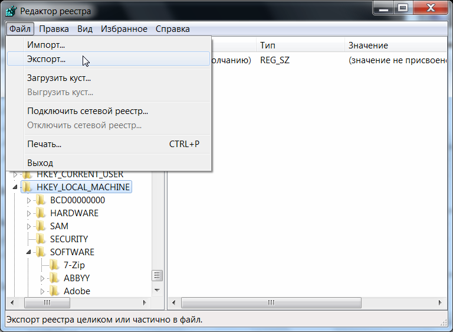

       Рис. 5 – Экспорт веток реестра. Создание резервной копии.

Экспортированный файл будет иметь расширение ``.reg``.

.. note:: Экспортированные из реестра файлы с расширением ``.reg`` являются простыми текстовыми файлами, их можно открыть любым простым текстовым редактором (Notepad++, Блокнот).

.. _import:

Восстановление реестра из резервной копии (Импорт)
--------------------------------------------------------------

Чтобы импортировать сохраненный файл реестра, достаточно дважды нажать левой кнопкой мыши по файлу с расширением ``.reg``.

Также можно:

1) Открыть редактор реестра;
2) В меню *«Файл»* выбрать пункт *«Импортировать файл реестра»*;
3) В меню открытия файлов найти файл, который следует импортировать, выделить его и нажать кнопку *«Открыть»*.

.. note:: Операции экспорта и импорта используются не только для создания резервных копий. Практическое использование данных функций рассмотрено в главе :ref:`experience` данного руководства.

Поиск в реестре
--------------------------------------------------------------

Для быстрого доступа к параметром можно воспользоваться функцией поиска по реестру, которая находится в меню *«Правка → Найти»* (``Ctrl+F``).

Для перемещения между найденными значениями используется *«Правка → Найти далее»* (``F3``).

.. _hive-load:

Загрузка и выгрузка куста
--------------------------------------------------------------

Допустим, имеется жесткий диск с нерабочего компьютера. Чтобы получить доступ к определенным веткам реестра, который хранится на этом жестком диске, необходимо:

1. Подключить жесткий диск к рабочему компьютеру;
2. Открыть реестр на рабочем компьютере;
3. Выбрать необходимую ветку реестра;

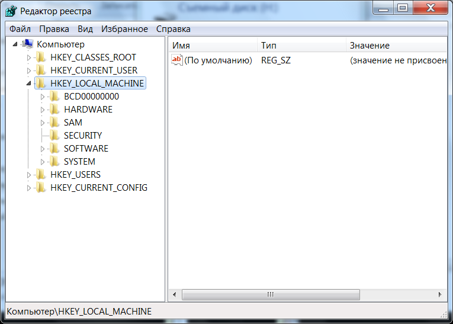

       Рис. 6 – Выбор ветки

4. Перейти в меню *«Файл → Загрузить куст»*;

.. figure:: img/registry-007.png
       :width: 400 px
       :align: center
       :alt: Рис. 7 – Выбор ветки

       Рис. 7 – Выбор ветки

4. В файловом менеджере выбрать соответствующий файл куста с нерабочего компьютера;

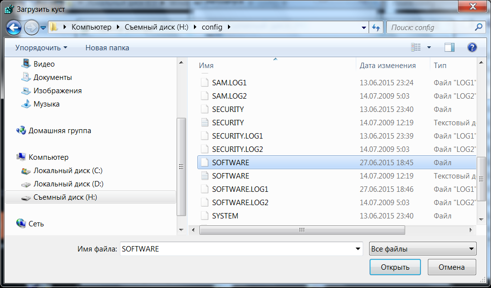

       Рис. 8 – Выбор ветки

5. Задать произвольное имя загруженному кусту.

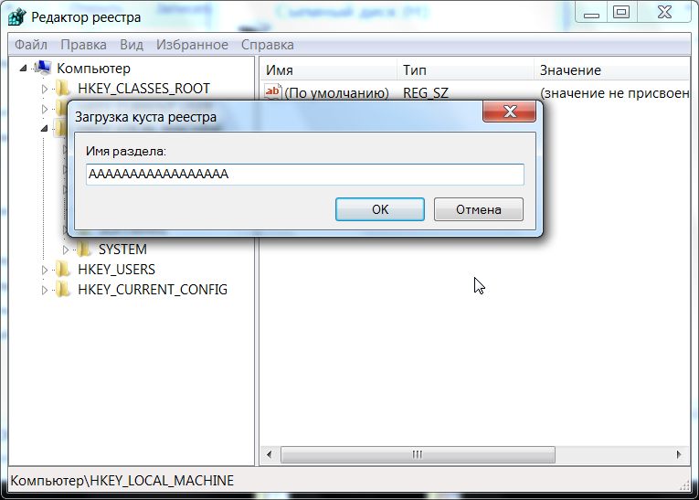

       Рис. 9 – Присвоение произвольного имени разделу

В соответсвии с примером, в ветку ``HKEY_LOCAL_MACHINE`` работающего компьютера была загружена ветка ``HKEY_LOCAL_MACHINE\Software`` с неработающего компьютера.

Для загрузки других веток реестра, необходимо выбирать соответствующие файлы на жестком диске. Таблица соответсвия веток реестра и файлов на жестком диске приведена в главе :ref:`hive-hd` данного руководства.

.. note:: Также допустимо скопировать папку ``C:\Windows\System32\config\`` на обыкновенную флешку и загружать требуемые кусты с нее.

.. tip:: При работе с загруженными кустами есть нюанс, который заключается в разрешениях (правах) на доступ к тем или иным разделам. Подробнее о разрешениях написано в разделе :ref:`regedit-rules` данной главы.
 
 Более простой способо обойти подводные камни с разрешениями на ветки заключается в использовании утилиты ``psexec.exe``, работа с которой описана в разделе :ref:`psexec`.

После завершения работы с загруженными кустами, их желательно выгрузить. Для этого необходимо перейти в *«Файл → Выгрузить куст»*.

.. _regedit-rules:

Права доступа (Разрешения)
--------------------------------------------------------------

Все разделы реестра имеют права доступа или разрешения. Если у текущего пользователя нет прав на определенный раздел, то будет выведено сообщение об ошибке и запрете доступа к данному разделу.

Прав доступа может не быть по нескольким причинам:

1) У текущего пользователя, залогиненного в системе, нет прав администратора;
2) Группа «Администраторы» является владельцем раздела, но не имеет полных прав на него. В этом случае достаточно просто выдать группе «Администраторы» полные права.
3) Владельцем раздела является системная служба TrustedInstaller.
4) Владельцем раздела является системная учетная запись «Система».

В первом случае необходимо обращаться к системному администратору, чтобы он предоставил доступ к учетной записи администратора или дал администраторские права пользователю.

Во втором случае необходимо присвоить полные права и сменить владельца.

.. _all-rules:

Получение полных прав и смена владельца
~~~~~~~~~~~~~~~~~~~~~~~~~~~~~~~~~~~~~~~~~~~~~~~~~~~~~~~~~~~~~~

1. Нажать правой кнопкой мыши на раздел и выбрать пункт *«Разрешения»*;

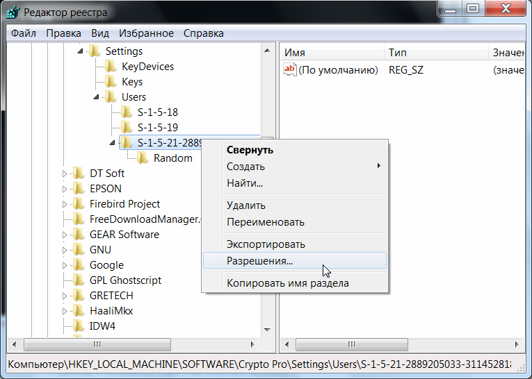

       Рис. 10 – Вызов диалога работы с разрешениями

2. Выделить текущего пользователя:

 * Если доступен флажок *«Полный доступ»*, установить его и нажать кнопку *«ОК*. Этого может оказаться достаточно, если группа является владельцем раздела.

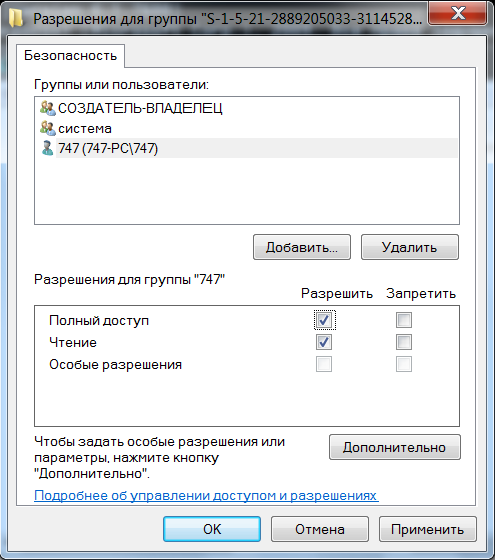

       Рис. 11 – Открытие Полного доступа гурппам и пользователям

Если отсутствует необходимый пользователь, флажок *«Полный доступ»* недоступен или возникает сообщение об ошибке, переходите к пункту 3.

3. В меню разрешений нажать кнопку *«Дополнительно»*;

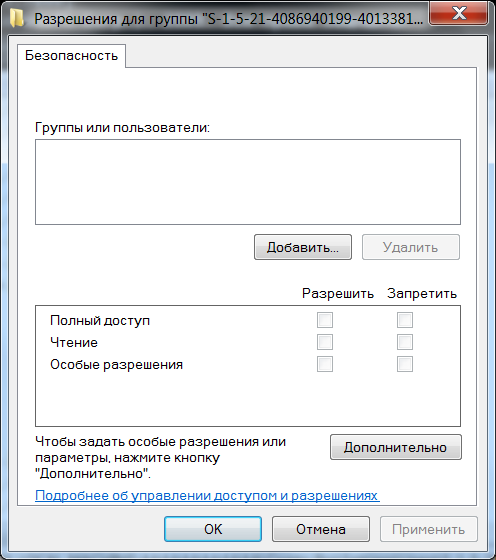

       Рис. 12 – Добавление или смена владельца

.. note:: Во время добавления разрешений и владельцев могут возникать сообщения об отсутсвии прав доступа. Данные сообщения можно смело игнорировать.

Перейти на вкладку *«Владелец»* и добавить текущего пользователя;

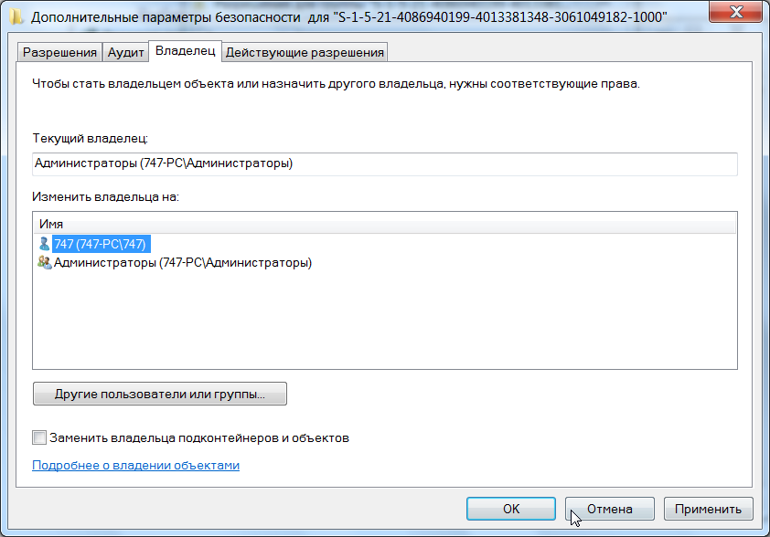

       Рис. 13 – Выбор владельца

На вкладке *«Разрешения»* нажать кнопку *«Добавить»*;

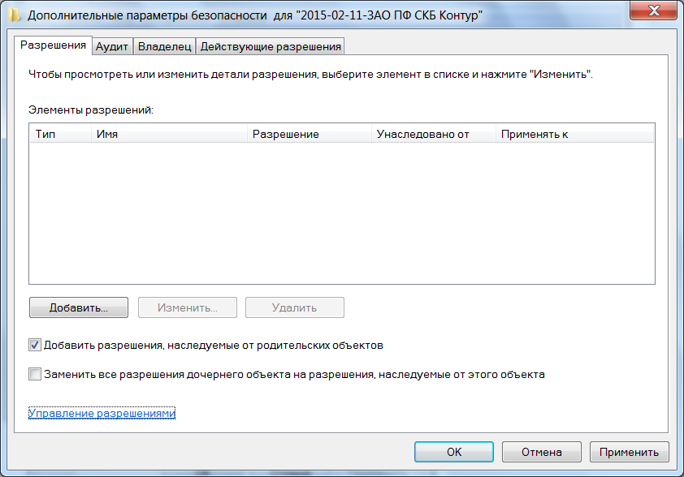

       Рис. 14 – Добавление разрешений владельцу

В поле *«Введите имена выбираемых объектов»* ввести имя текущей учетной записи и нажать кнопку *«Проверить имена»*, затем нажать *«ОК»*;

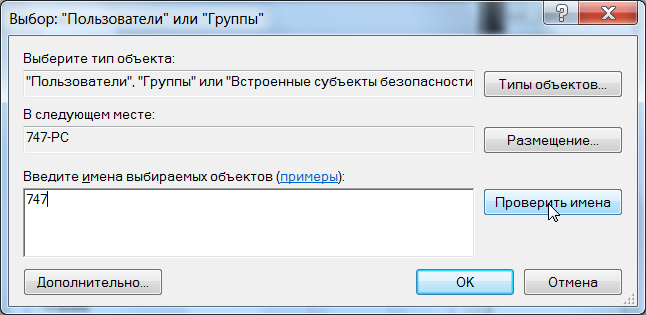
       
       Рис. 15 – Ввод имени выбираемых объектов

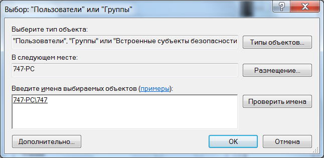

       Рис. 16 – Проверка имен

Появится диалог разрешений. Поставить галочку напротив *«Полный доступ»* и нажать *«ОК»*;

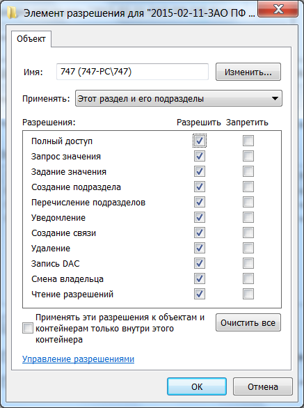

       Рис. 17 – Установка полного доступа текущему владельцу

После добавления владельца и назначения прав нажать клавишу ``F5`` или *«Вид → Обновить»*. Напротив непустого раздела появится треугольник, который означает, что у текущего пользователя есть права на доступ в него.

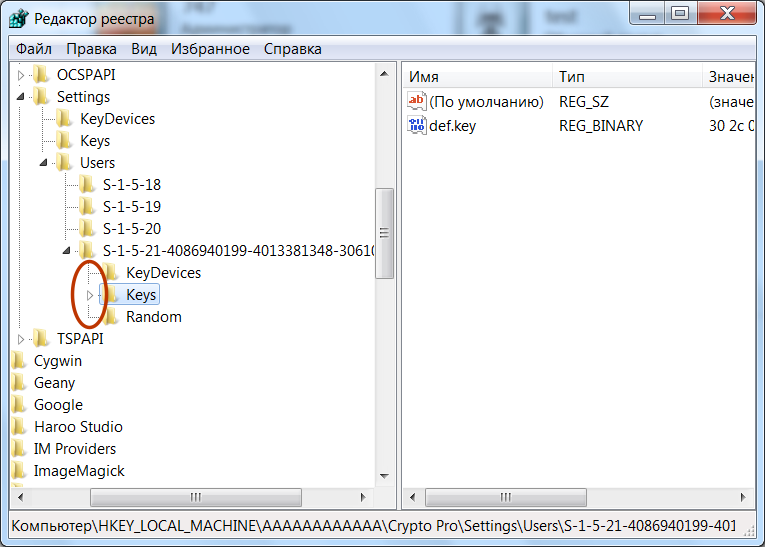

       Рис. 18 – Доступ к подразделам

На рисунке 18 видно, что у текущего пользователя есть доступ к подразделу ``Keys``, но нет прав на открытие разделов ``KeyDevices`` и ``Random``. Треугольника напротив подраздела может не быть, если данный подраздел пуст.

.. note:: **В Windows 8 и выше** порядок работы с диалогом смены и добавления владельца немного отличается – владелец выбирается сверху.
 
 .. figure:: img/registry-019.png
       :width: 400 px
       :align: center
       :alt: Рис. 19 – Выбор/смена владельца в Windows 8 и выше

       Рис. 19 – Выбор/смена владельца в Windows 8 и выше [11]

.. tip:: Ручное добавление владельцев и прав доступа удобно, если нужно получить доступ всего к нескольким разделам. Если нужно получить доступ к большому количеству разделов, то гораздо целесообразнее воспользоваться утилитой ``PsExec.exe``. Работа с данной утилитой рассматривается в разделе :ref:`psexec`.

.. _psexec:

Работа через утилиту PsExec
~~~~~~~~~~~~~~~~~~~~~~~~~~~~~~~~~~~~~~~~~~~~~~~~~~~~~

.. index:: PsExec.exe

Для запуска редактора реестра с полными правами от имени системы можно воспользоваться программой `PsExec.exe <https://technet.microsoft.com/ru-ru/sysinternals/bb897553.aspx>`_.

1. `Скачайте <http://download.sysinternals.com/files/PSTools.zip>`_ утилиту ``PsExec.exe`` и скопируйте в корень диска ``C``.
2. Запустите командную строку от имени администратора. *«Пуск → Выполнить → cmd»*.
3. Введите в командную строку команду: 

::
    
    C:\PsExec.exe -i -s regedit.exe

Запустится редактор реестра от имени системы, что задается параметром ``-s`` (параметр ``-i`` обеспечивает интерактивный запуск приложения)[11].

Если возникает сообщение об ошибке ``Couldn't install PSEXESVC service...``, то необходимо отключить контроль учетных записей Windows (UAC):

.. index:: UAC

1. Меню *«Пуск → Панель управления»*;
2. *«Учетные записи пользователей → Изменение параметров контроля учетных записей»*;
3. Сдвинуть ползунок до самого низа — *«Никогда не уведомлять»*;
4. Перезагрузить компьютер.

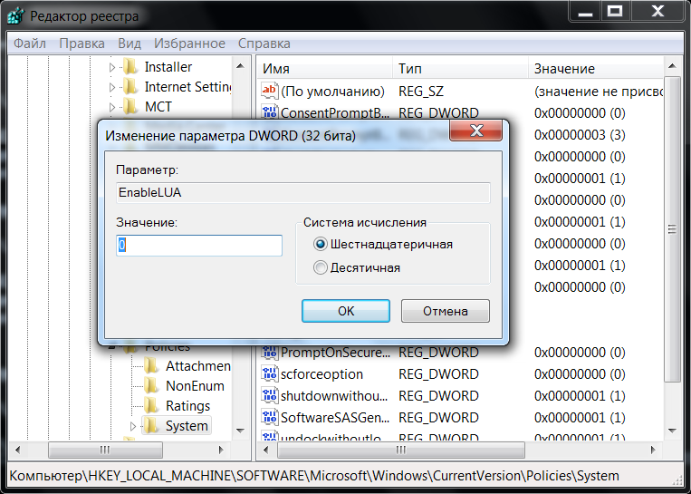

       Рис. 20 – Отключение параметров контроля учетных записей (UAC)

В Windows Vista в диалоговом окне *«Пуск → Панель управления → Учетные записи пользователей → Включение и отключение контроля учетных записей»* снять галочку *«Используйте контроль учетных записей для защиты компьютера»*.

В Windows 8 и выше для полного отключения контроля учетных записей (UAC) необходимо в реестре в ветке ``HKEY_LOCAL_MACHINE\Software\Microsoft\Windows\CurrentVersion\Policies\System`` присвоить параметру ``EnableLUA`` значение ``0``. 

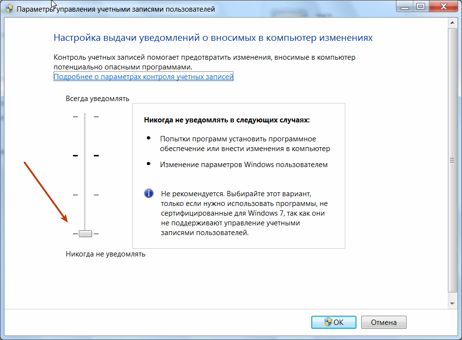

       Рис. 21 – Отключение параметров контроля учетных записей (UAC) в Windows 8 и выше

.. attention:: После отключения параметров контроля учетных записей (UAC) необходима перезагрузка.

Добавление и удаление элементов
--------------------------------------------------------------

Для создания разделов, подразделов и параметров, необходимо перейти в меню  *«Правка → Создать»* и выбрать необходимый тип создаваемого элемента. Либо нажать правой кнопкой мыши и в появившемся меню выбрать пункт *«Создать»*.

.. figure:: img/registry-022.png
       :width: 400 px
       :align: center
       :alt: Рис. 22 – Создание разделов, подразделов и параметров

       Рис. 22 – Создание разделов, подразделов и параметров

Более подробную информацию о *типах параметров* смотрите в статье `Сведения о реестре Windows для опытных пользователей <https://support.microsoft.com/ru-ru/kb/256986>`_.